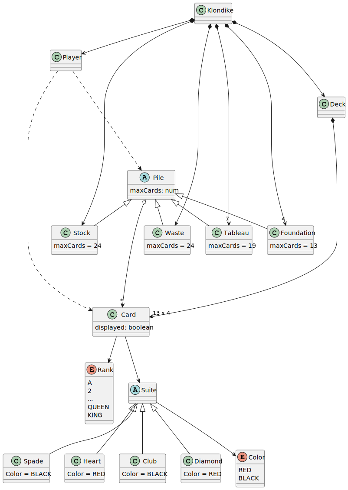
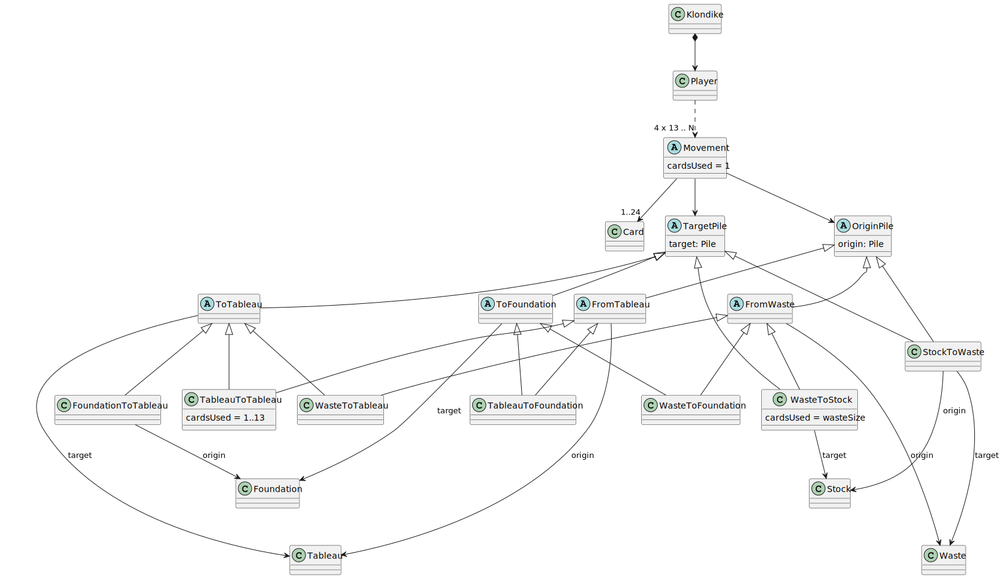
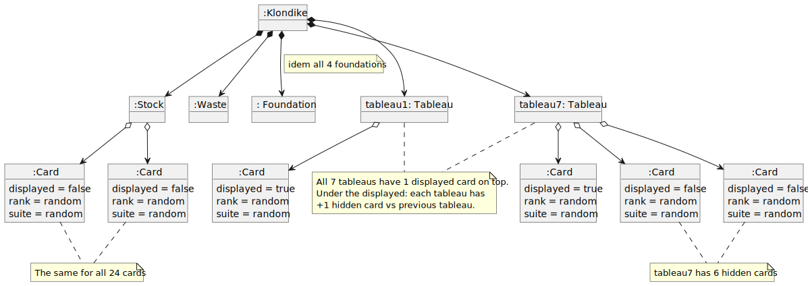
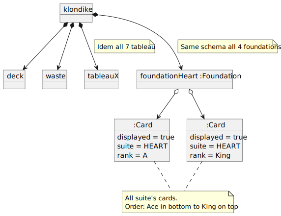
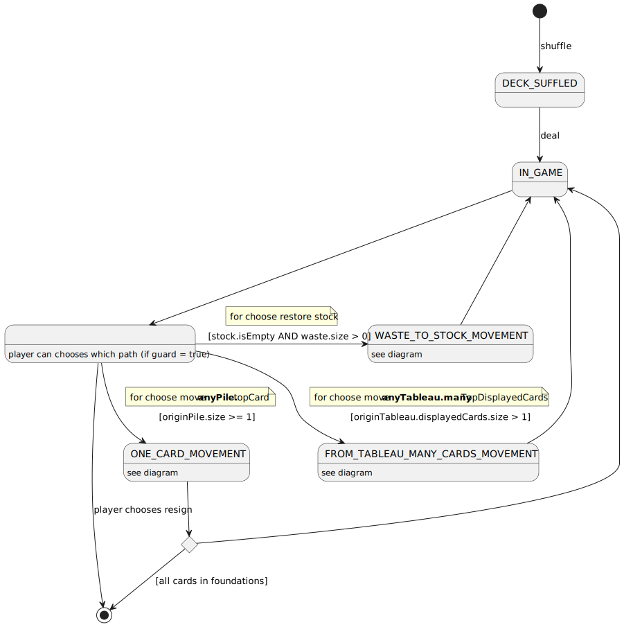
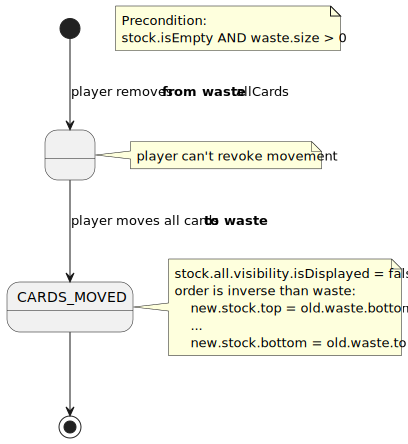
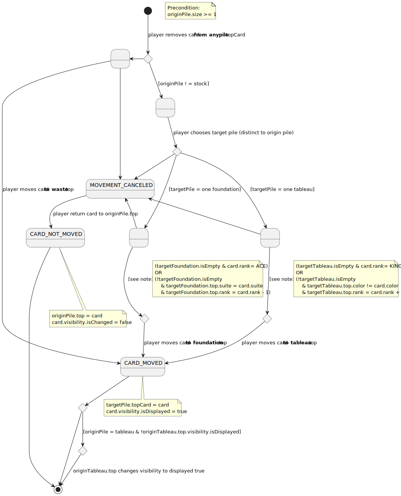
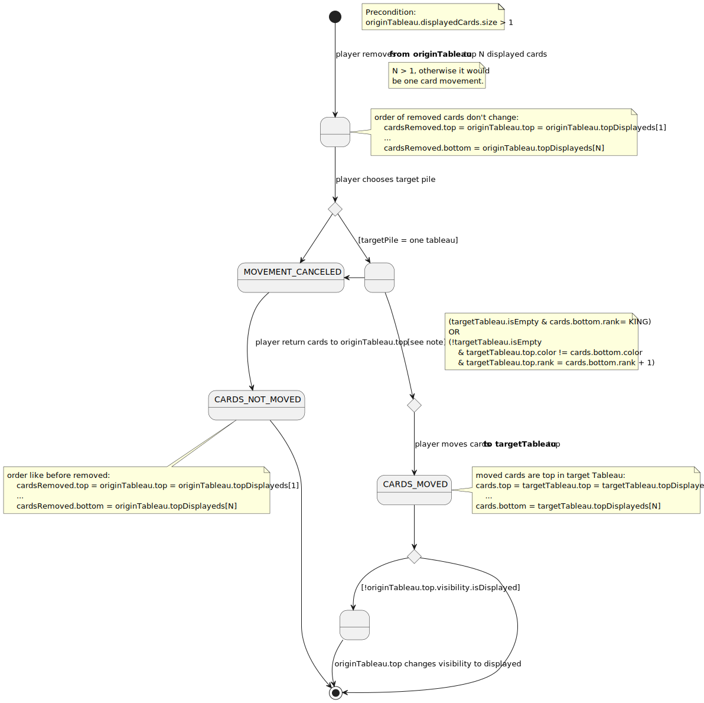
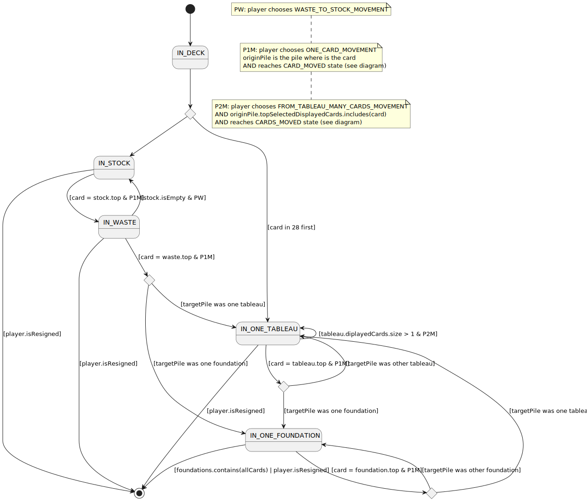

# Klondike
Universo Santa Tecla  
[uSantaTecla@gmail.com](mailto:uSantaTecla@gmail.com)  

## index

* [domainModel](#domainModel)  
    * [vocabulary](#vocabulary) 
    * [vocabulary events](#vocabularyEvents)
    * [initialState](#initialState)  
    * [finalState](#finalState)
    * [instructions](#instructions)  
    * [card lifecycle](#card-lifecycle)
* [versions](#versions)
    * [0.0.dataLanguage](./0.0.dataLanguages/README.md)
    * [0.0.publicationLanguage](./0.0.publicationLanguage/README.md)
    * [1.0.basic](./1.0.basic/README.md)
    * [1.1.machine](./1.1.machine/README.md)
    * [2.0.graphics](./2.0.graphics/README.md)
    * [3.0.undoRedo](./3.0.undoRedo/README.md)
    * [4.0.distributed](./4.0.distributed/README.md)
    * [5.0.files](./5.0.files/README.md)
    * [6.0.bbdd](./6.0.bbdd/README.md)

## domainModel  
  
  

[WIKI](https://es.wikipedia.org/wiki/Solitario_de_cartas)

[Youtube](https://www.youtube.com/watch?v=yjgQXcFVBQY)
### vocabulary

  

### vocabularyEvents

  
### initialState  
  
  
  
### finalState 

  
  
### instructions
  

- Waste to stock movement
  

- One card movement
  

- Many cards movement from tableau
  

### card lifecycle

  

  
## versions  
  
  
